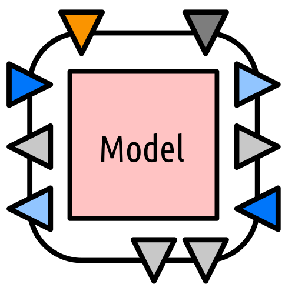

# Conversion of scenarios into co-simulation

## Why co-simulation ?

Co-simulation can be defined as the coupling of simulation tools (also referred to as simulators) for assessing a partitioned complex system. The idea is to partition a system into sub-systems, modelling each of them separately with a specific simulator and to re-create the global behaviour of the complete system by exchanging data between the models of the sub-systems at simulation runtime. Within this context, a co-simulation tool is the software synchronizing execution and data exchange of the individual simulators coupled within a co-simulation.

## ZerOBNL features

#### What ZerOBNL can do:
- Distributed simulation (on a real cluster or just connecting two computers)
- Cross-platform simulation (Linux, Windows and/or MacOS in the same simulation)

#### What ZerOBNL can not do:
- Coffee
- Database (see our [article](https://www.researchgate.net/publication/327754115_FIRST_STEPS_TOWARDS_LINKING_SEMANTIC_3D_CITY_MODELLING_AND_MULTI-DOMAIN_CO-SIMULATION_FOR_ENERGY_MODELLING_AT_URBAN_SCALE?_iepl%5BviewId%5D=nYBAo5z65FFelGu9sKV1UGEe&_iepl%5Bcontexts%5D%5B0%5D=projectUpdatesLog&_iepl%5BtargetEntityId%5D=PB%3A327754115&_iepl%5BinteractionType%5D=publicationTitle) for that)

## Modelling process

#### 1. Partition system

This is the core part of large scale multi-domain co-simulation, defining how you will cut your large system into smaller one and how the information will flow between the sub-systems.
Examples: 
- do you put a heat pump and its associated controller in the same sub-system or in two different one ?
- do you want to transfer mass flow [kg/s] and temperature [°C] or only a thermal power [kW] ?
- what is the optimal communication step size between the sub-systems ?

#### 2. Choose tools

#### 3. Implement models

ZerOBNL only help to connect tool together, it's your job create needed models for your simulation.
They need to allow for 3 features:

1. set attribute
2. get attribute
3. make a step (fixed or variable)

#### 4. Create wrappers

Wrappers are the key point between simulation tools and the rest of the co-simulation framework.
Using the ZerOBNL ClientNode python class, this process will, during the simulation, be used as middle agent between the orchetration process and the simulation model, passing messages and data back and forth.

#### 5. Define abstractions

This is when you need to define the conceptual co-simulation model by creating *Meta-models*, *Models* and *Nodes*.
Those concepts are detailled below.

#### 6. Create co-simulation graph

The co-simulation is closely related on how you decide to partition your system.
This is where you actually connect the sub-systems together and define the exhanged data using *Links* (detailled below)

#### 7. Run simulation

Once everything is ready, you need then to run the simulation and go take a coffee, depending on how you defined your sub-systems, the number of them, the communication step size you choose and the avaiable computation power this can take som time !

#### 8. Access results

During simulation results and variables of the different sub-systems are stored into a Redis database, the ZerOBNL API give you some methods to collect and export them.

#### 9. Analys results

Well, do whater you want or need to do with the results...

## Communication channels (with local node)

The simplest way to run a model is to "dockerize" it.
If it's not possible you can still run simulation nodes directly on you computer.

## Abstractions

- Meta-models
`add_meta()`

The fundamental building blocks is the so-called meta-model, which defines the generalized features of a specific component (or group of components) of the complete system. More precisely, it defines the attributes a simulation model of such a component (or group of components) has to implement. In terms of co-simulation, the attributes are basically the inputs and outputs of an individual simulation model.

- Models
`add_model()`

The abstract definition of a meta-model is implemented by so-called models. In general, several models may implement the same meta-model, expressing differences associated to the modelling approach (levels of detail, model of computation, etc.) or the physical component they represent (e.g., different technologies for the same type of component). Models are directly associated to containerized applications.

- Nodes
`add_node()`

Finally, a node is an actual instance of a model that is to be deployed as an individual simulator in a co-simulation. In general, several node instances of the same model can be present in a co-simulation.

- Links
`add_link()`

The inputs and outputs of nodes (implicitly defined through the linked meta-model) can be connected using links. Each link can associate exactly one input with one output.

- Groups / Sequence / Steps
`create_group()`, `create_sequence()` and `create_steps()`

## Co-simulation graph

The connections and links between the simulators modelling the sub-systems form a co-simulation graph. A co-simulation graph can be represented as a directed graph with the simulators (and their models) of the sub-systems as nodes and links connecting model inputs and outputs as edges. Each node represents an individual technical component or a group of technical components (a building with its decentralized heat production, a centralized heat-pump, a power grid, etc.). The models require data, parameters and possibly geographical informations in order to reproduce the behavior of the depicted component or group of components. 